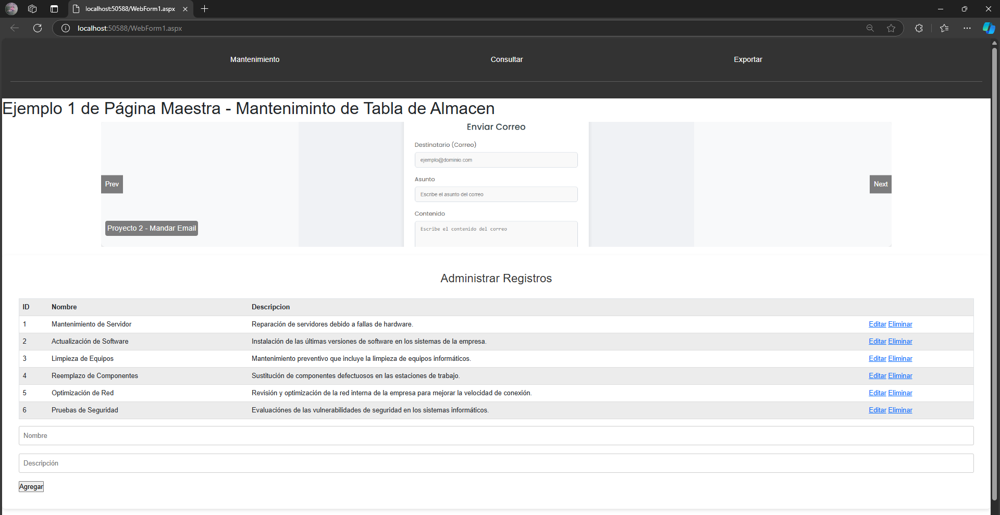
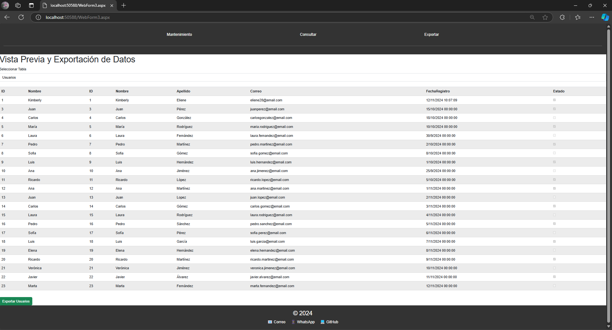
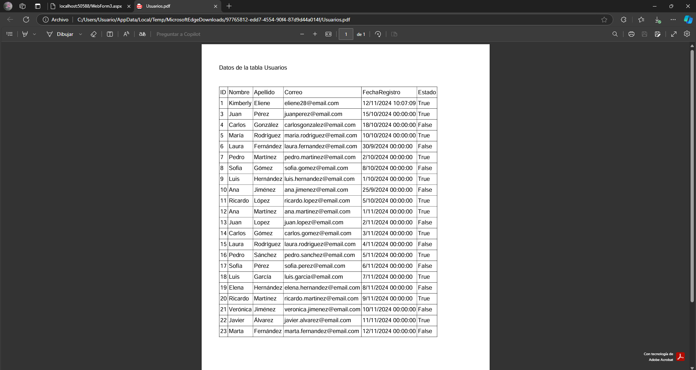

# Gestión de Mantenimiento y Exportación a PDF

Este proyecto consiste en una aplicación web que permite gestionar registros de mantenimiento, consultar datos almacenados en una base de datos y exportar la información seleccionada a formato PDF. Está diseñado para facilitar el proceso de mantenimiento y administración de equipos o sistemas mediante una interfaz intuitiva y fácil de usar.

## Funcionalidades

1. **Página de Mantenimiento**  
   Permite agregar, editar y eliminar registros de mantenimiento en la base de datos. Los usuarios pueden ingresar detalles sobre el equipo, fecha, y descripción del mantenimiento realizado.

   

2. **Página de Consulta**  
   Muestra una lista de los registros de mantenimiento almacenados en la base de datos. Los usuarios pueden filtrar y consultar información sobre los mantenimientos previos.

   

3. **Página de Exportación a PDF**  
   Permite a los usuarios seleccionar y exportar los datos consultados en formato PDF. Esta funcionalidad es útil para crear informes o guardar los registros para uso futuro.

   
   

## Tecnologías Utilizadas

- **Frontend**: HTML, CSS, JavaScript
- **Backend**: PHP (para la interacción con la base de datos)
- **Base de Datos**: MySQL
- **Generación de PDFs**: [iText 7](https://itextpdf.com/) (usado para la exportación a PDF)
- **Framework**: Bootstrap (para diseño responsivo)